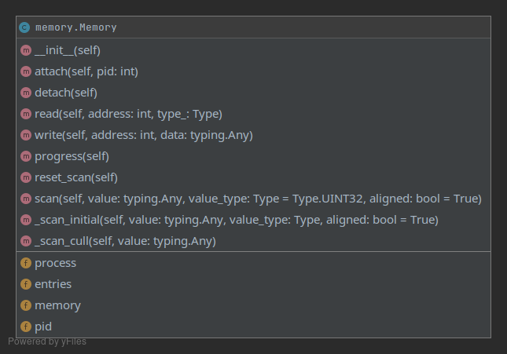

# Program architecture

## Structure
The structure is pretty simple, the gui stuff will reside within [gui](../src/gui)
and the Qt ui files will then reside withing the ui folder. All the "relevant"
classes will then be placed within their respective folders, i.e. 
the widgets folder for widgets, models for models etc.

Most of the other things simply reside within src currently since I've
not come up with any other good place to put them.

## User interface
The user interface currently has two views

- The scanning view
- The process listing view

Each of these are implemented with their own classes. Multiple views may
be seen at a time. The main window is implemented in [here](../src/gui/main_window.py)

To use essentially any feature you need to first attach to a process by pressing
``File->attach``, alternatively you may press ``F2``.

## Logic

### [Memory](../src/core/memory.py)

The logic is pretty simple, the main window has a ``Memory`` object which 
handles the scanning, reading and writing part.

The main functions to look at are ``scan``, ``read`` and ``write``.
Which are fairly self-explanatory; as of today (19.4.2021) the scan
function is working but is fairly memory inefficient and probably slow
it could use some work to make it better.

### [Value](../src/core/value.py)

The way values are handled is through the `Value` class, it basically
is just a container for an address, original value and a type.

The purpose of the read/write functions are to make it easy to update
the value of the address and to eventually support freezing. (essentially
just constantly writing to the address at certain preferably configurable
intervals).

### [Type](../src/core/type.py)

For brevity I've left out the the functions, but essentially the class
provides functions for parsing a byte string to the given type. Getting the correct
`struct` format, and getting the size of the type. The functions are
given below, and are fairly self explanatory which is which.

- `size`
- `get_format`
- `parse_value`
