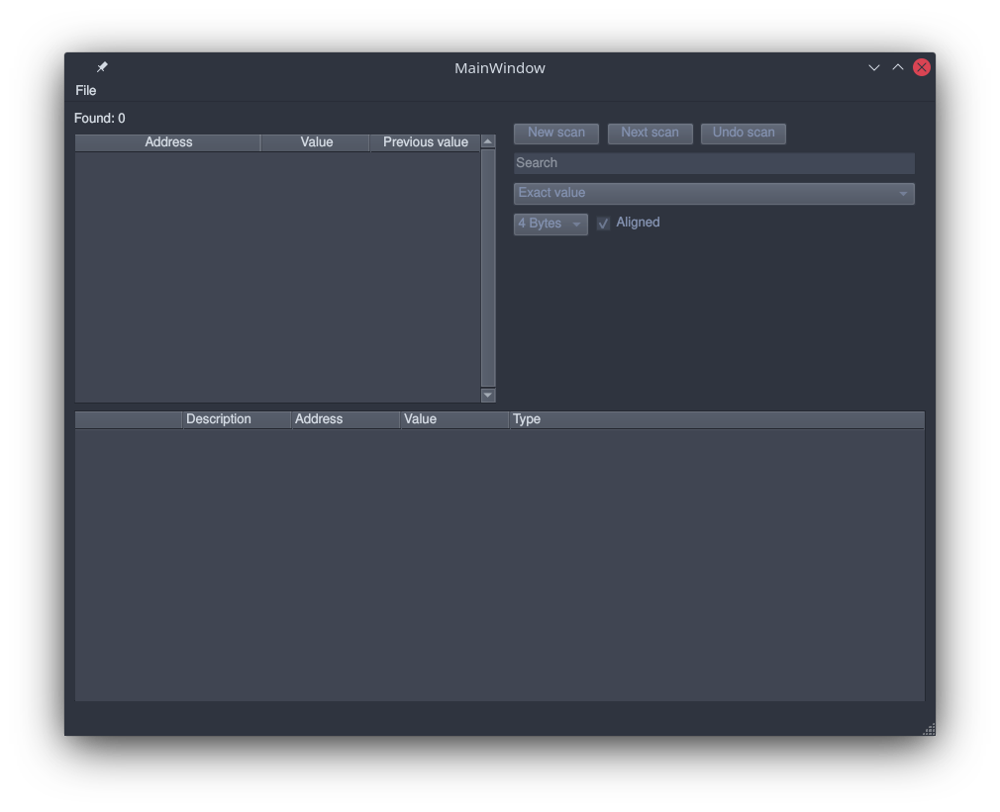
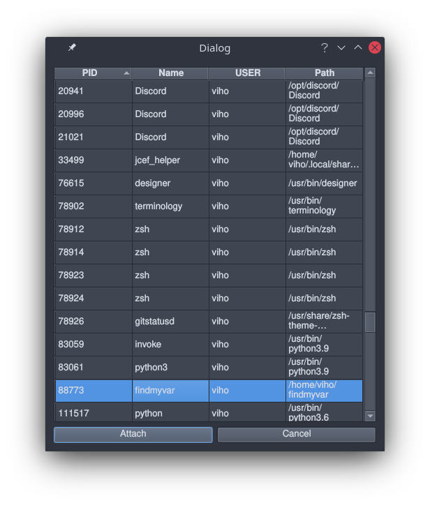
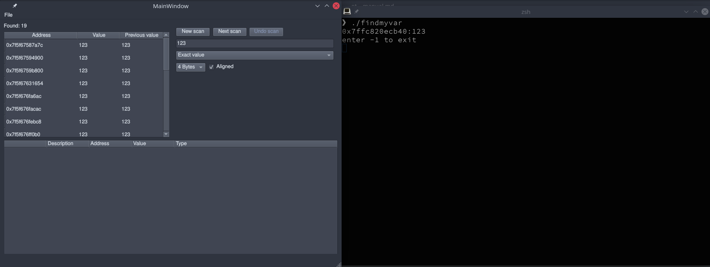
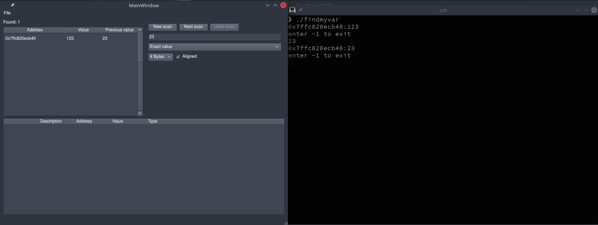

# Manual
Download the latest release from [here](https://github.com/vikke1234/ot-project/releases)

## Executing
You need to start by installing all the dependencies.
```shell
poetry install
```

After which you need either need to run this command 
(you can read more about it in README.md) or then you need to execute the program as root

```shell
echo 0 | sudo tee /proc/sys/kernel/yama/ptrace_scope
```

## Usage
The main window looks like this



To begin using the program you need to attach to a process, you can do that by pressing
`File->attach`

You will then get a window which looks like this, it's simply a list of active processes you can 
choose from by either double clicking or highlighting an entry and clicking `Ok`



**NOTE**: Some processes will not allow you to attach to them, for example `systemd`, you can't 
read from its memory.

You can now scan a processes' memory, you do so by typing into the `Search` and pressing either 
`New scan` or `Next scan`. You will first press the `New scan` to get an initial list of entries.
After which you should change the value and look for the updated value with `Next scan`.

There exists some configuration for the search, as of now it only allows to configure either 
aligned or unaligned searches. Though there' future plans to add more kinds of searching.

Here you can see an example case, we initially find 19 different values containing `123`, after 
which we look for 23 and find only 1 result for it. You should essentially do this process until 
you find the address you're looking for.




This is the program used for the example. Compile with ``gcc findmyvar.c``

```c
#include <stdio.h>

int main(void) {
	int n = 123;
	int input = 0;
	while(1) {
		printf("%p:%d\nenter -1 to exit\n", &n, n);
		scanf("%d", &input);
		if(input == -1) {
			break;
		}
		n = input;
	}
		
	return 0;
}
```